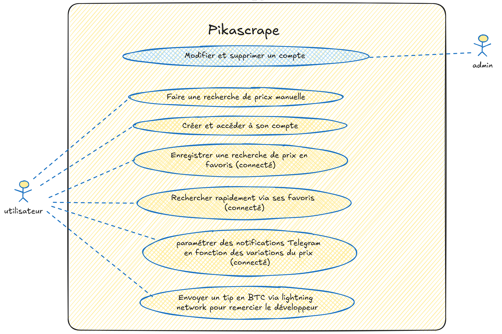

# Documentation Pikascrape

## Table des matières
1. [Introduction](#1-introduction)
2. [Problématique](#2-problématique)
3. [Fonctionnalités](#3-fonctionnalités)
4. [Architecture technique](#4-architecture-technique)
5. [Base de données](#5-base-de-données)
6. [Interfaces utilisateur](#6-interfaces-utilisateur)
7. [Charte graphique](#7-charte-graphique)
8. [Étapes de développement](#8-étapes-de-développement)

## 1. Introduction

**Pikascrape** est une application destinée à faciliter le suivi des variations de prix des cartes Pokémon sur la plateforme [CardMarket](https://www.cardmarket.com/fr/Pokemon). Elle permet aux utilisateurs d'automatiser la surveillance des prix pour identifier les opportunités d'achat-revente, rendant ainsi cette activité moins chronophage et plus efficace.

## 2. Problématique

L'identification des opportunités d'achat-revente de cartes Pokémon sur CardMarket est un processus chronophage qui nécessite une surveillance constante des variations de prix. **Pikascrape** vise à résoudre ce problème en automatisant ce processus, permettant aux utilisateurs de:
- Suivre les variations de prix en temps réel
- Recevoir des notifications lors de variations intéressantes
- Enregistrer et gérer facilement leurs recherches préférées

## 3. Fonctionnalités

### 3.1. Versions de l'application
- **CLI**: Interface en ligne de commande pour les utilisateurs avancés
- **GUI**: Interface graphique pour le web et Android, offrant une expérience utilisateur intuitive

### 3.2. Types d'utilisateurs et fonctionnalités

#### 3.2.1. Administrateur
- Modifier ou supprimer des comptes utilisateurs

#### 3.2.2. Utilisateur standard
- Créer et accéder à son compte
- Rechercher des prix de cartes avec filtres:
  - Nom d'utilisateur vendeur
  - Pays du vendeur
  - Type de vendeur
  - Langue de la carte
  - État de la carte (mint condition)
- Enregistrer ses recherches en favoris (bookmarks)
- Effectuer des recherches rapides via ses favoris
- Paramétrer des notifications conditionnelles basées sur les variations de prix
- Recevoir des notifications sur Telegram
- Envoyer un pourboire en BTC via le Lightning Network pour remercier le développeur

### 3.3. Gestion des sessions
- Connexion sécurisée
- Inscription
- Mode invité
- Déconnexion

## 4. Architecture technique

### 4.1. Technologies utilisées
- **Langage de programmation**: Java
- **Framework frontend**: Js
- **Base de données**: PostgreSQL
- **Notifications**: API Telegram

### 4.2. Environnements
- Interface en ligne de commande (CLI)
- Application Web

## 5. Base de données

### 5.1. Tables principales

#### 5.1.1. Table Users

| **Nom de la Colonne** | **Type de Donnée** | **Description**                            | **Contraintes**             |
| --------------------- | ------------------ | ------------------------------------------ | --------------------------- |
| **user_id**           | SERIAL4            | Identifiant unique de l'utilisateur        | PRIMARY KEY, AUTO_INCREMENT |
| **username**          | VARCHAR(255)       | Nom de l'utilisateur                       | NOT NULL                    |
| **email**             | VARCHAR(255)       | Adresse email unique                       | NOT NULL, UNIQUE            |
| **telegram_id**       | VARCHAR(255)       | Identifiant Telegram de l'utilisateur      | NOT NULL                    |
| **password_hash**     | VARCHAR(255)       | Mot de passe chiffré de l'utilisateur      | NOT NULL                    |
| **created_at**        | TIMESTAMP          | Date de la création du compte              | NOT NULL                    |
| **updated_at**        | TIMESTAMP          | Date de la dernière modification du compte | NOT NULL                    |

#### 5.1.2. Table Bookmarks

| **Nom de la Colonne** | **Type de Donnée** | **Description**                     | **Contraintes**             |
| --------------------- | ------------------ | ----------------------------------- | --------------------------- |
| **bookmark_id**       | SERIAL4            | Identifiant unique du bookmark      | PRIMARY KEY, AUTO_INCREMENT |
| **user_id**           | SERIAL4            | Identifiant unique de l'utilisateur | NOT NULL                    |
| **url**               | VARCHAR(255)       | URL du produit                      | NOT NULL                    |
| **created_at**        | TIMESTAMP          | Date de la création du bookmark     | NOT NULL                    |
| **updated_at**        | TIMESTAMP          | Date de la dernière modification    | NOT NULL                    |

### 5.2. Glossaire des termes

| **Terme**       | **Définition**                                                              |
| --------------- | --------------------------------------------------------------------------- |
| **Utilisateur** | Personne ayant un compte et accédant au système                             |
| **Telegram**    | Application de messagerie permettant de recevoir des notifications          |
| **Bookmarks**   | URL enregistrée par un utilisateur pour réaliser une requête plus rapidement |

## 6. Interfaces utilisateur

### 6.1. Écrans principaux

#### 6.1.1. Écran d'accueil
- Options de connexion, inscription et mode invité
- Design inspiré de l'interface classique des jeux Pokémon

#### 6.1.2. Écran principal (connecté)
- Nom d'utilisateur affiché
- Bouton pour lancer une nouvelle recherche
- Accès aux bookmarks
- Option de déconnexion

#### 6.1.3. Écran de recherche
- Filtres disponibles:
  - Nom d'utilisateur vendeur
  - Pays du vendeur
  - Type de vendeur
  - Langue de la carte
  - État de la carte
- Bouton pour lancer la recherche

#### 6.1.4. Écran de gestion des bookmarks
- Liste des bookmarks enregistrés
- Option pour ajouter/supprimer des bookmarks
- Bouton retour

## 7. Charte graphique

### 7.1. Logo et identité visuelle
- Logo "Pikascrape" en jaune sur fond bleu
- Icône de Pokéball en pixel art
- Thématique visuelle inspirée de l'univers Pokémon et des jeux rétro

### 7.2. Palette de couleurs

#### 7.2.1. Couleurs primaires
| Couleur             | Hexadecimal | RGB            |
|---------------------|-------------|----------------|
| **Bleu Principal**   | #005A9C     | rgb(0, 90, 156)|
| **Jaune Pokémon**    | #FFC300     | rgb(255, 195, 0)|

#### 7.2.2. Couleurs secondaires
| Couleur             | Hexadecimal | RGB            |
|---------------------|-------------|----------------|
| **Gris Foncé**      | #333333     | rgb(51, 51, 51)|
| **Gris Clair**      | #F1F1F1     | rgb(241, 241, 241)|

#### 7.2.3. Couleurs d'action
| Couleur             | Hexadecimal | RGB            |
|---------------------|-------------|----------------|
| **Rouge (actions critiques)**  | #FF3B3B     | rgb(255, 59, 59)|
| **Vert (confirmations)**   | #28A745     | rgb(40, 167, 69)|

### 7.3. Typographie
- **Police principale**: Roboto
  - Titres: Roboto Bold, 24-36px
  - Corps de texte: Roboto Regular, 16px
- **Police secondaire**: Open Sans
  - Sous-titres et boutons: Open Sans Light, 18px

### 7.4. Éléments d'interface
- **Boutons**: Fond jaune avec bordure bleue, texte bleu
- **Champs de formulaire**: Fond blanc avec bordure grise
- **Éléments actifs**: Changement de couleur au survol

### 7.5. Style visuel
- Interface inspirée des jeux Pokémon classiques de Game Boy
- Utilisation d'éléments pixelisés pour renforcer l'aspect nostalgique
- Boutons avec apparence de menus de jeu rétro

## 8. Étapes de développement

1. **Analyse des besoins**: Identification des fonctionnalités essentielles
2. **Conception de l'architecture**: Choix des technologies et design de la base de données
3. **Développement des fonctionnalités CLI**: Mise en place des commandes de base
4. **Création de l'interface web**: Développement de la GUI avec les fonctionnalités clés
5. **Développement de l'application Android**: Adaptation des fonctionnalités pour mobile
6. **Tests**: Vérification de la robustesse de l'application et correction des bugs
7. **Déploiement**: Mise en ligne des différentes versions de l'application

---

## Annexes

### Diagramme de cas d'utilisation

Le diagramme ci-dessus illustre les différentes interactions entre:
- L'administrateur qui peut gérer les comptes utilisateurs
- L'utilisateur standard qui peut effectuer diverses actions comme la recherche de prix, l'enregistrement de favoris et la configuration de notifications

### Maquettes d'interface

Les maquettes montrent les principales interfaces de l'application:
- Écran de connexion/inscription
- Dashboard utilisateur
- Écran de recherche
- Gestion des bookmarks
